# Playwright

Playwright Test was created specifically to accommodate the needs of end-to-end testing. Playwright supports all modern rendering engines including Chromium, WebKit, and Firefox. Test on Windows, Linux, and macOS, locally or on CI, headless or headed with native mobile emulation of Google Chrome for Android and Mobile Safari.

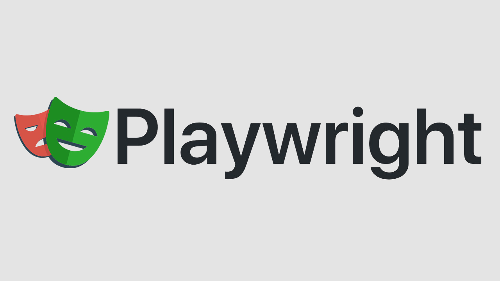

[playwright](https://playwright.dev/)

## ⚙️ Introduction.

This lab has the objective of testing Playwright end-to-end.

## 🛠 Stack.

<ol>
  <li>Cursor</li>
  <li>Playwright</li>
  <li>Html</li>
  <li>Javascript</li>
  <li>Node</li>
  <li>Npm</li>
</ol>

## ⚙️ Install Playwright.

https://playwright.dev/docs/intro#installing-playwright

```shell
npm init playwright@latest
```

## ⚙️ Running the Example Test

https://playwright.dev/docs/intro#running-the-example-test

```shell
npx playwright test
```

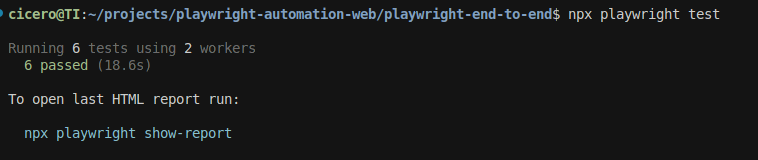

## ⚙️  HTML Test Reports

```shell
npx playwright show-report
```
https://playwright.dev/docs/intro#html-test-reports

link to access: http://localhost:9323/

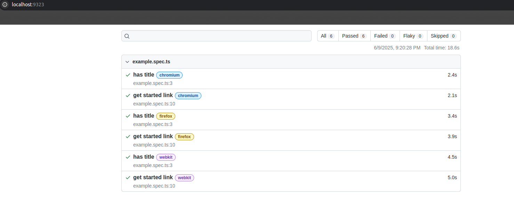


## ⚙️ Running the Example Test in UI Mode

```shell
npx playwright test --ui
```

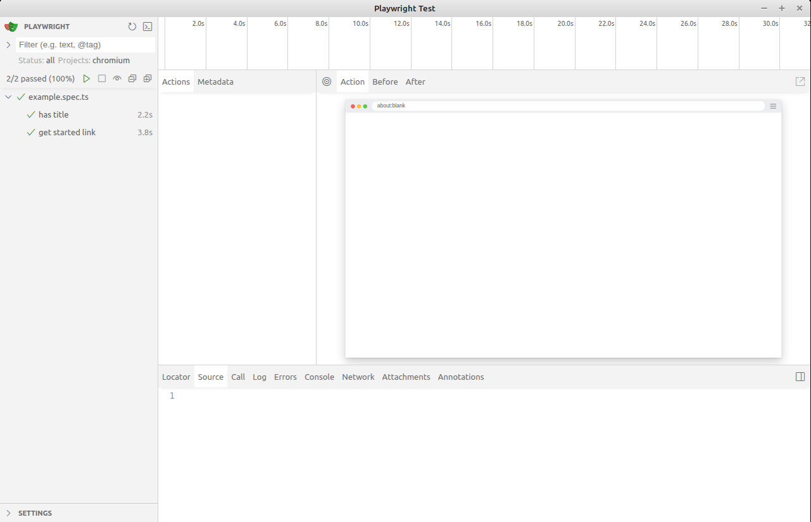

## ⚙️ Generating tests with Codegen

https://playwright.dev/docs/codegen-intro

> [!TIP]
> Using the sample server http of the python.
>```shell
>python3 -m http.server 8000
>```

```shell
npx playwright codegen http://127.0.0.1:8000/index.html
```
It will open two windows, a browser window where you interact with the website you wish to test and the Playwright Inspector window where you can record your tests

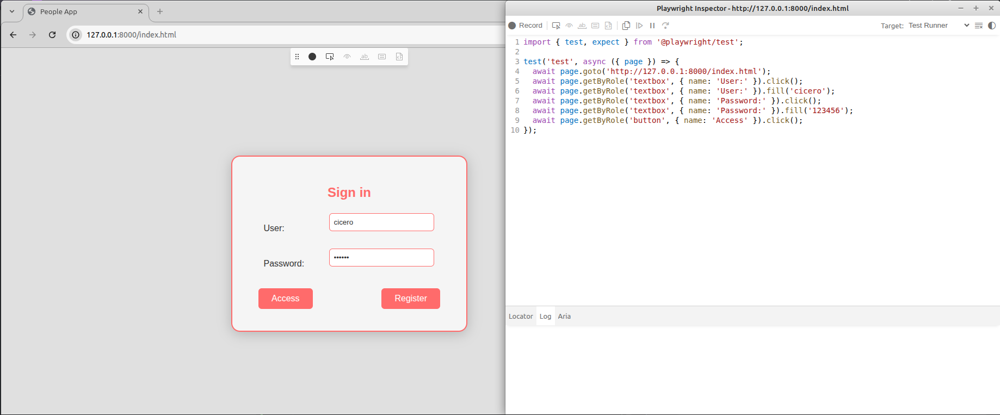

After this, copy the code and paste it into the new file.

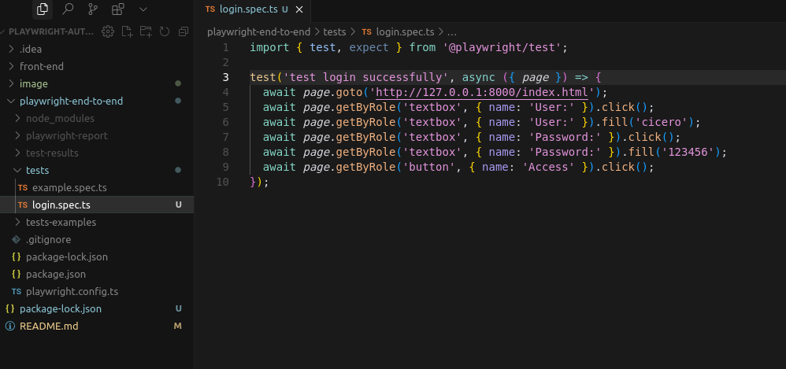

## ⚙️ Generate complete tests with Codegen

```shell
npx playwright codegen http://127.0.0.1:8000/index.html
```
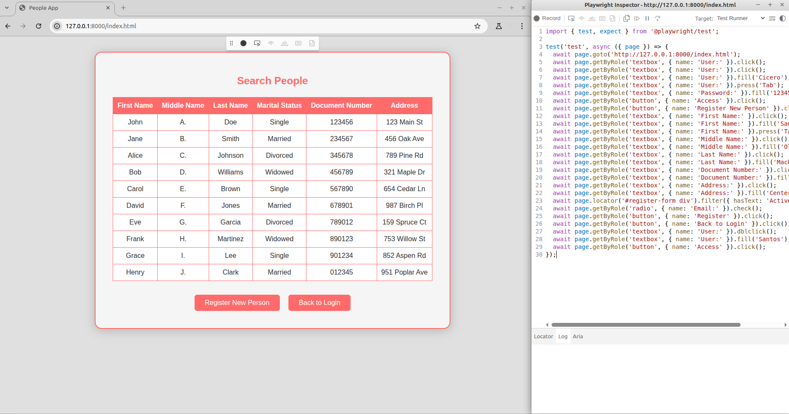

After this, copy the code and paste it into the new file.

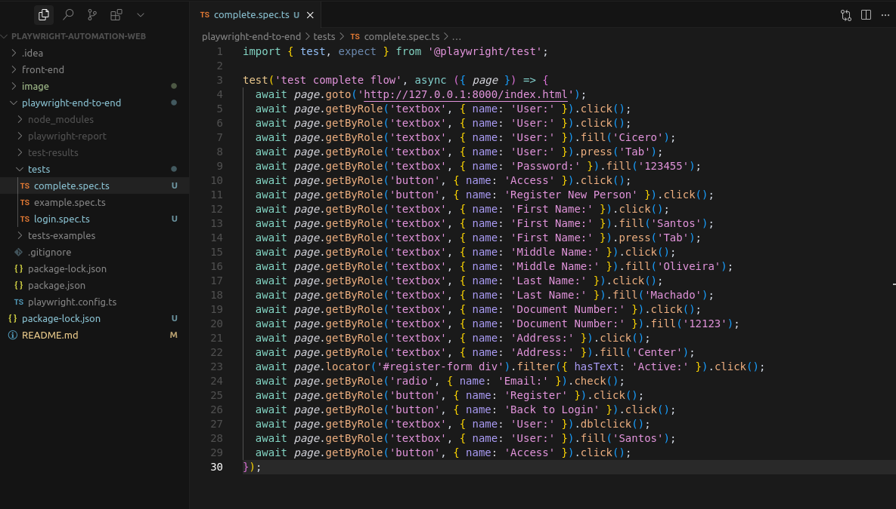

Execute the command below to see UI with tests.
```shell
npx playwright test --ui
```
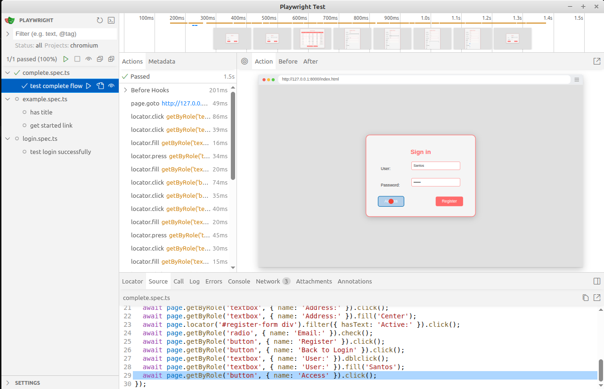


## ⚙️ Front-End.

Login:

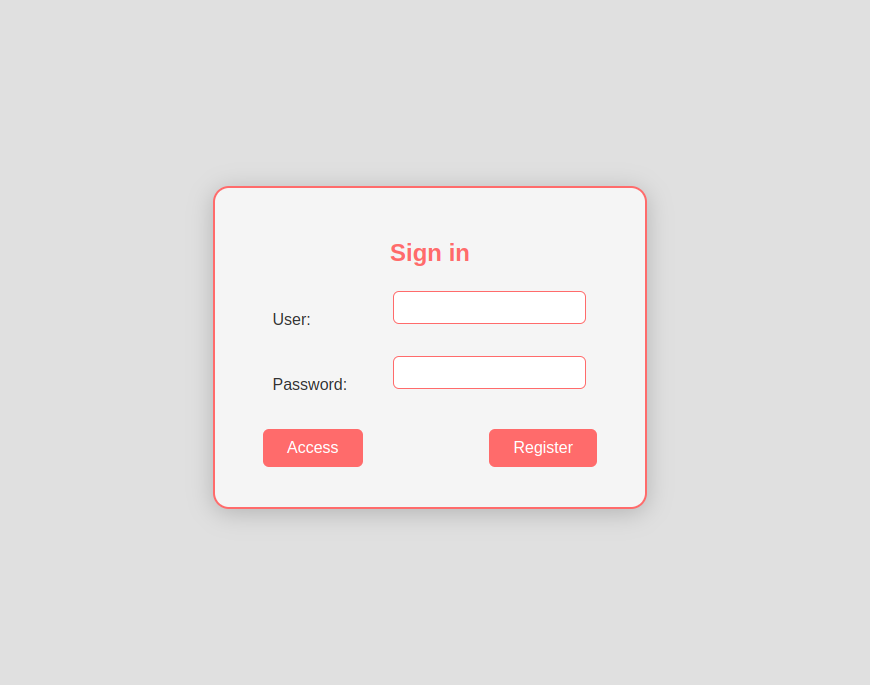

Register:

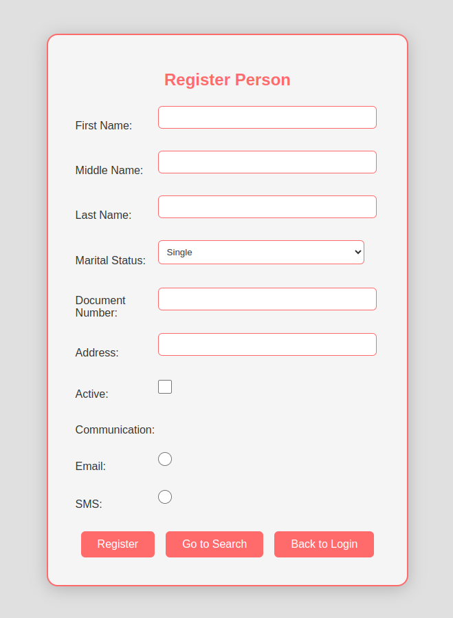

Search:

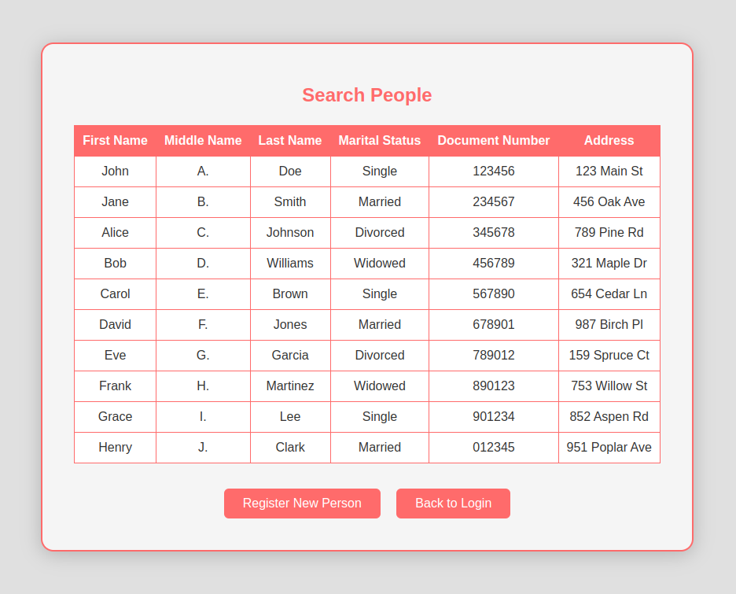

## 📌 Version.

1.0

## ✒️ Author.

Cícero Ednilson - ciceroednilson@gmail.com

